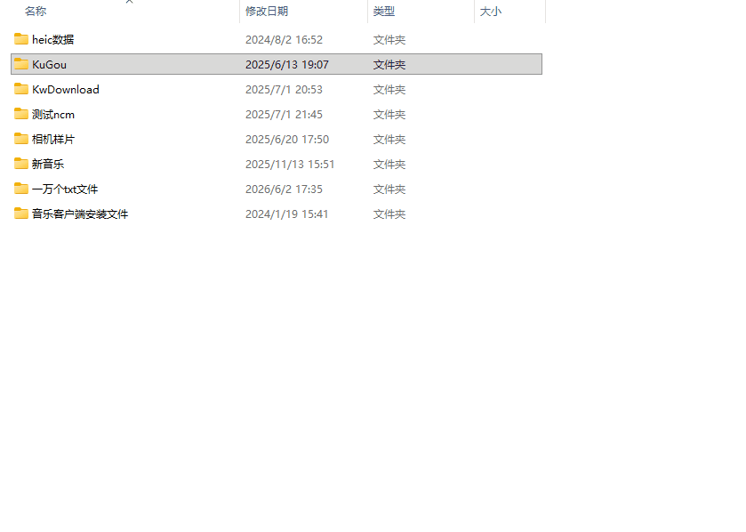

# 文件树生成

> 自动扫描指定文件夹，生成清晰的文件树结构，并复制到系统剪贴板

## 简介

选中任意文件夹，一键生成层级分明的文件树结构，自动复制到剪贴板，可直接粘贴到文档、邮件、笔记中使用。适用于项目结构展示、文档编写、文件夹归档整理等场景。

## 运行环境

本脚本核心依赖 **PowerShell 5.1+** 运行环境。推荐用[不忙脚本盒子](https://bm-box.com)运行本脚本，盒子可自动为脚本配置环境依赖，同时原生提供快捷键、右键菜单、定时任务等多种触发方式，开箱即用，大幅降低使用门槛。

## 脚本演示

## 安装方法

1. 打开**不忙脚本盒子**
2. 进入「脚本市场」
3. 搜索「**文件树生成**」
4. 点击「安装」即可使用

## 使用方法

### 右键菜单

在文件夹上点击右键 → 「不忙脚本盒子」→「文件树生成」，即可一键生成该文件夹的文件树结构。

### 快捷键

设置全局快捷键后，选中文件夹按下快捷键即可触发，无需打开右键菜单。

## 输出结果

- 文件树结构自动复制到系统剪贴板
- 完成后在[不忙脚本盒子](https://bm-box.com)界面显示成功通知

## 更新日志

### v1.0.0 (2026-06-05)

- 首次发布

---

*本脚本通过[不忙脚本盒子（BmScriptsBox）](https://bm-box.com)分发与管理*
